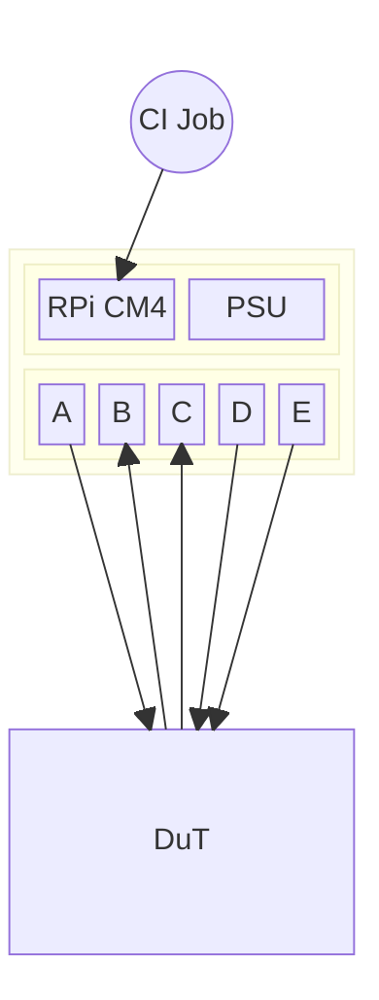

# HiL Validation Suite 🧪

Hardware-in-the-Loop, or HiL (sometimes HitL), is a way to continuously validate your hardware and firmware together. By connecting actual hardware to virtual test scenarios, HiL enables thorough testing of embedded systems, control units, and firmware under realistic conditions without the risks and costs of full physical testing.

HiL testing catches integration issues early, accelerates development cycles, and ensures robust system performance before deployment. Typically the domain of the most sophisticated automotive and aerospace companies, this HiL suite is now for all 🚀.

## Usage

If you haven't already, get [atopile](https://docs.atopile.io/dev/quickstart/) and run through the quickstart and tutorial.

This suite is intended to be used as a dependency on your project. So, create a new project (`ato create project`) and add this suite as a dependency (`ato install https://github.com/atopile/hil`)

### Project Structure

This suite is opinionated about project structure, interfaces and the controller.

There should be three main components on your HiL:

- A controller, which should typically be a Raspberry Pi CM4
- A power supply unit (PSU)
- A set of IOs, which should be connected to the DuT. These are the interesting bits

### Software

Under construction 🚧

## Goals - The magic HiL suite 🪄

Project goals and aspirations:

 - Continuously validate your firmware, before each PR, on all of your hardware platforms
 - Automate your hardware validation, rather than poking and prodding it on a lab bench
 - Be the best developer board you've ever used

### Non-goals

 - Generic lab equipment. Sometimes these things look really similar, however generic lab equipment places an emphasis on performance, robustness and self-containedness that makes it a generic tool, rather than an embedded custom-built tool for a specific application. If there are modules in this suite you want to use generically, **awesome!**. It however isn't our goal to create them
